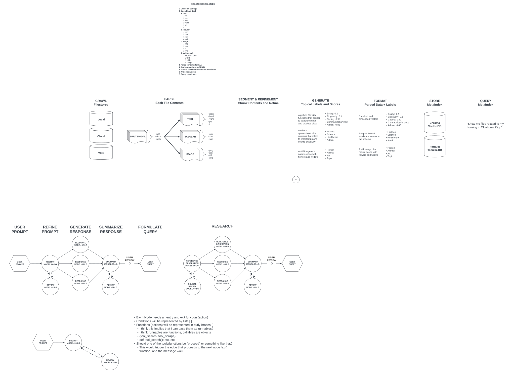

# dawgpyl  
Directing Agents With Graphs Python Library
Developed by: Erik L. Hodges, Ph.D.

## Description
Recent advances in large language models (LLMs) allow these models to reliably output structured content. Because of this, a new era of tool-using agents has been unlocked.
This library attempts to structure interactions between these agents in such a way that a user can define a goal and a team of agents will work to attain it.

Each agent (team-member) can be customized (using configs/agents.py AND configs/prompts.py) to guide and bound its behavior.

Projects > Teams > Agents (individual LLMs)

Teams of agents can be pre-specified (using configs/projects.py AND configs/teams.py) to follow standardized workflows.

## Architecture

